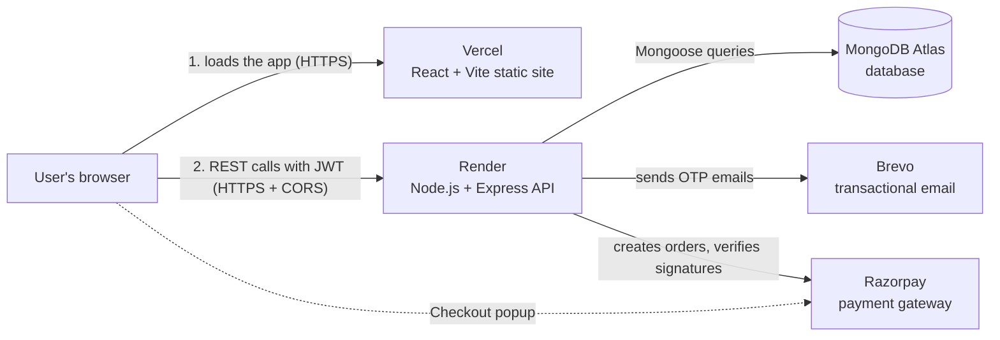
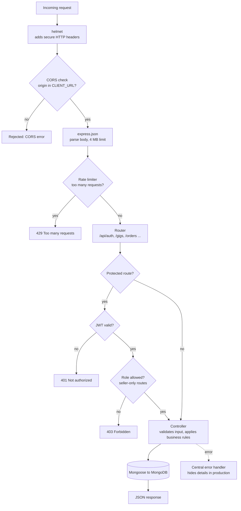
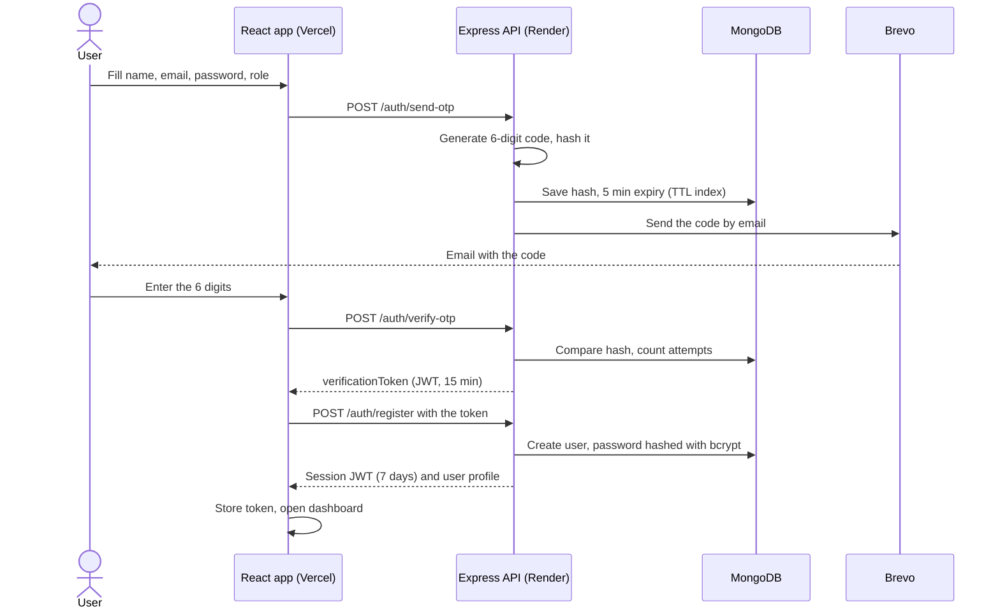
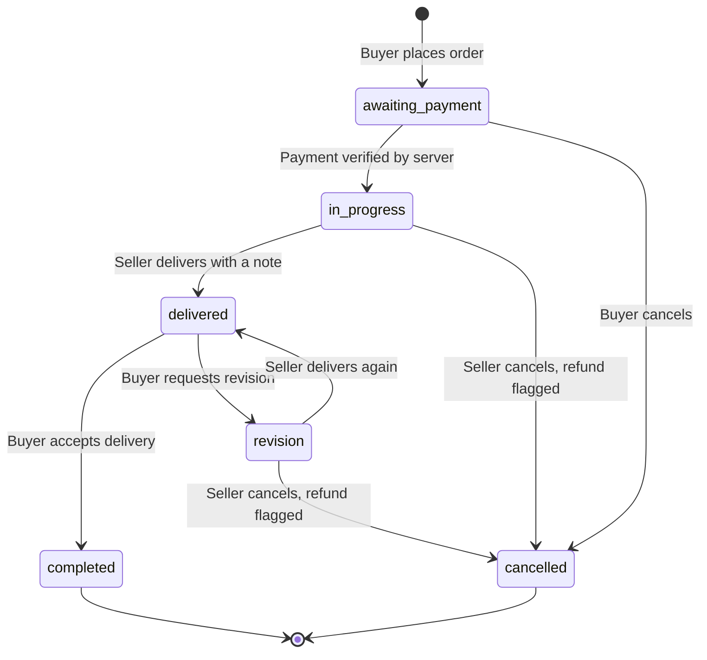
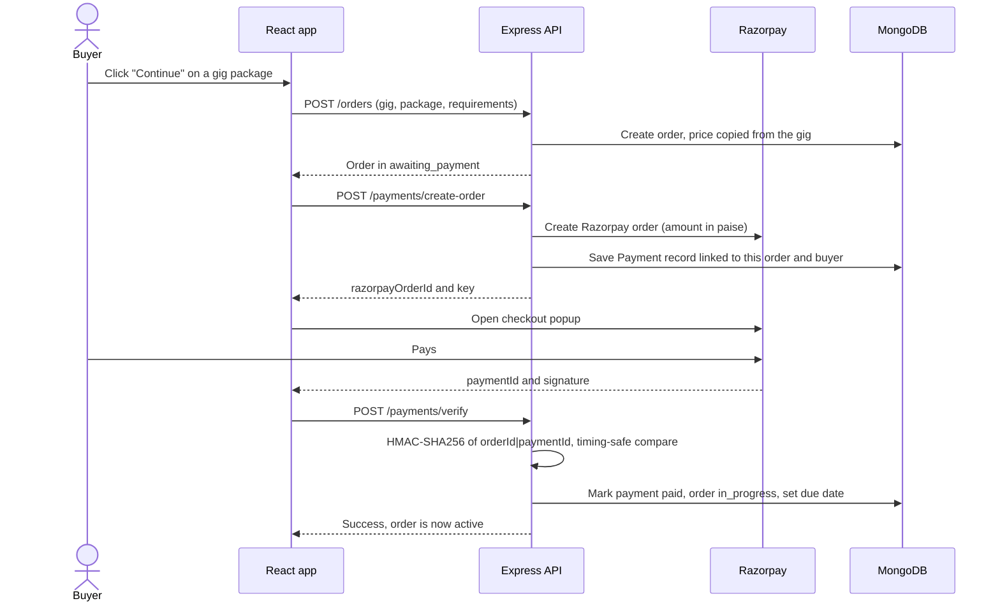
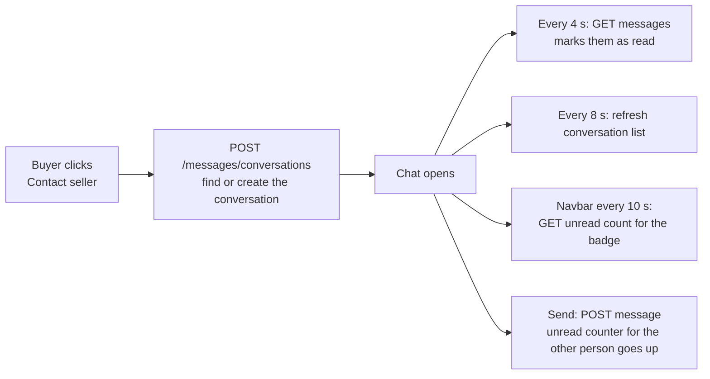
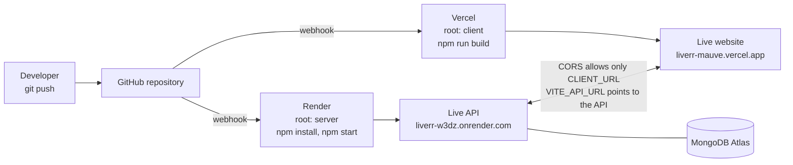
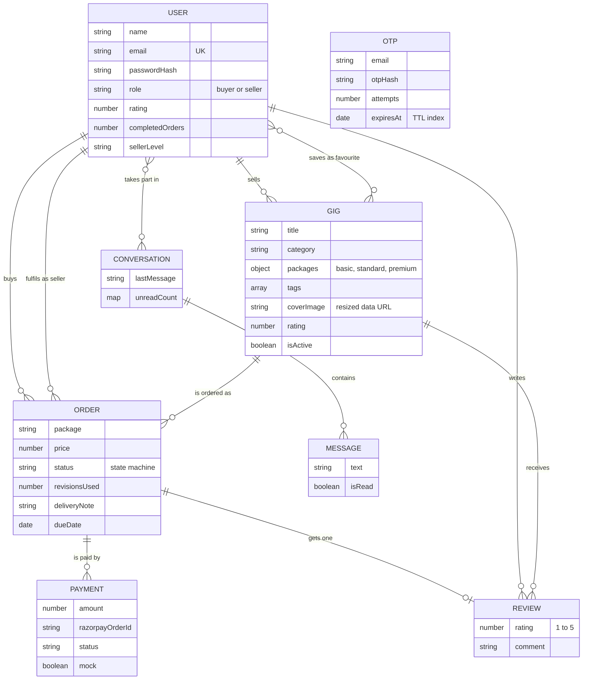

# Liverr

**A Fiverr-style freelance marketplace built with the MERN stack.**
Sellers publish services ("gigs") in three price packages. Buyers find them, order, pay, chat with the seller, request revisions, accept the delivery and leave a review.

## 🌐 Live demo

| | Link |
|---|---|
| **Website (Vercel)** | https://liverr-mauve.vercel.app |
| **API (Render)** | https://liverr-w3dz.onrender.com |
| **API health check** | https://liverr-w3dz.onrender.com/api/health |

> **Heads-up:** the API runs on Render's free tier, which goes to sleep after about 15 minutes without traffic. The first request after a pause can take 30 to 60 seconds while it wakes up. After that it is fast.
> Payments on the demo run in **test mode** (a "Simulate payment" button) unless real Razorpay keys are configured, so no real money moves.

---

## Table of contents
1. [What Liverr does](#what-liverr-does)
2. [Features](#features)
3. [Tech stack](#tech-stack)
4. [System architecture](#system-architecture)
5. [How a request travels through the server](#how-a-request-travels-through-the-server)
6. [Pipelines explained](#pipelines-explained) (signup, order lifecycle, payment, messaging, deployment)
7. [Database design](#database-design)
8. [Techniques and design decisions](#techniques-and-design-decisions)
9. [Security measures](#security-measures)
10. [Project structure](#project-structure)
11. [Run it locally](#run-it-locally)
12. [Environment variables](#environment-variables)
13. [Deployment guide](#deployment-guide)
14. [API reference](#api-reference)
15. [Troubleshooting](#troubleshooting)
16. [Known limitations and future work](#known-limitations-and-future-work)

---

## What Liverr does

Liverr connects two kinds of people:

- **Sellers** (freelancers) create gigs such as "I will design your logo", each with up to three packages (Basic, Standard, Premium) that differ in price, delivery time, revisions and features.
- **Buyers** (clients) browse and search gigs, pick a package, pay securely, share requirements, talk to the seller, and approve the work when they are happy.

An account is either a buyer or a seller, and a buyer can upgrade to seller with one click. Every order moves through a strict set of states, so neither side can skip a step: a buyer cannot mark unpaid work as "completed", and a seller cannot complete their own order.

---

## Features

| Area | What you get |
|---|---|
| **Accounts** | Email OTP verification at signup, login with JWT, forgot/reset password through OTP, buyer and seller roles, "Become a seller" |
| **Gigs** | Create, edit, pause, delete. Three packages, cover image, tags. Gigs that already have orders are paused instead of deleted so order history stays intact |
| **Discovery** | Category pages, text search, price and delivery filters, 5 sort options, pagination |
| **Orders** | Full lifecycle with role-based rules (see the state diagram below), requirements text, delivery notes, limited revisions |
| **Payments** | Razorpay checkout with server-side signature verification tied to the exact order. Built-in test mode when no keys are set |
| **Messaging** | Buyer to seller chat, unread badges, auto-refresh by polling |
| **Reviews** | One review per completed order, written only by the buyer. Gig and seller ratings are recalculated automatically |
| **Seller levels** | New Seller, Level One (5 orders), Level Two (20), Top Rated (50), based on completed orders |
| **Dashboards** | Seller: net earnings (after a 20% platform fee), pending earnings, active orders, level. Buyer: spending and order counts |
| **Profiles** | Public seller profile, editable bio, skills, languages, avatar |
| **Extras** | Saved gigs (favourites), responsive layout, loading and error states, 404 page |

---

## Tech stack

| Layer | Technology | Why it was chosen |
|---|---|---|
| Frontend | **React 18**, **Vite**, **React Router 6** | Fast dev server, simple client-side routing |
| Styling | **Tailwind CSS 3** | Utility classes keep the UI consistent without large CSS files |
| HTTP client | **Axios** | Interceptors attach the JWT and handle expired sessions in one place |
| Backend | **Node.js 18+**, **Express 4** | Small, well-known REST framework |
| Database | **MongoDB Atlas** with **Mongoose** | Flexible documents suit gigs with optional packages; Mongoose adds schemas and validation |
| Auth | **JWT** (jsonwebtoken), **bcryptjs** | Stateless sessions, salted password hashes |
| Security | **helmet**, **cors**, **express-rate-limit** | Secure headers, origin allow-list, brute-force protection |
| Email | **Brevo** HTTP API (also supports Resend and SMTP) | Sends OTP emails; an HTTPS API works on free hosts that block SMTP |
| Payments | **Razorpay** | Indian payment gateway (INR), signed payment confirmations |
| Hosting | **Vercel** (frontend), **Render** (backend), **MongoDB Atlas** (database) | All have a free tier |

---

## System architecture

The browser only ever talks to two places: the static site on Vercel and the API on Render. The API is the single gatekeeper to the database and to third-party services.



**Key idea:** the frontend is a single-page app. Vercel serves the same `index.html` for every path (see `client/vercel.json`), and React Router decides what to show. All data comes from the API as JSON.

---

## How a request travels through the server

Every API call passes through the same chain of middleware before it reaches your code. A request can be stopped at any step.



---

## Pipelines explained

### 1. Signup with email OTP

New accounts must prove they own the email. The OTP is stored only as a **hash**, expires after 5 minutes, and allows 5 wrong guesses. After verification the server hands the browser a short-lived **verification token**, and registration only succeeds with that token.



Password reset uses the same OTP flow with `purpose = reset`, and it does not reveal whether an email has an account.

### 2. Order lifecycle (state machine)

An order is a **state machine**. The server holds a table of which role may move an order from which state to which. Anything else is rejected with an error, so the rules cannot be bypassed from the browser.



| From state | Buyer may | Seller may |
|---|---|---|
| awaiting_payment | cancel | nothing |
| in_progress | nothing | deliver, cancel |
| delivered | complete, request revision (if any are left) | nothing |
| revision | nothing | deliver, cancel |
| completed / cancelled | nothing | nothing |

When an order becomes **completed**, the gig's order count goes up, the seller's completed-orders count goes up, and the seller's level is recalculated. Only then can the buyer leave a review.

### 3. Payment flow

The browser never decides that a payment succeeded. The server creates the payment record, and it only marks the order as paid after checking the gateway's cryptographic signature.



**Test mode:** if the Razorpay keys are missing or dummy, the server creates a mock payment and the checkout page shows a "Simulate payment" button. On a production server this is blocked unless `ALLOW_MOCK_PAYMENTS=true` is set, so a live site cannot be tricked into giving away free orders by accident.

### 4. Messaging

Chat uses simple **polling** instead of WebSockets, which keeps the server stateless and works on free hosting.



### 5. Deployment pipeline (CI/CD)

There is no manual build step. Pushing to GitHub triggers both hosts.



Secrets (database URI, JWT secret, API keys) are typed into the Render and Vercel dashboards. They are never in the repository, because `.gitignore` blocks every `.env` file.

---

## Database design

Eight collections. Relationships are stored as ObjectId references, and Mongoose `populate()` joins them when needed.



The `OTP` collection stands alone: records are looked up by email and purpose, and MongoDB deletes them automatically when `expiresAt` passes (a **TTL index**).

---

## Techniques and design decisions

| Technique | Where it is used | What it achieves |
|---|---|---|
| **Stateless JWT auth** | `middleware/auth.js`, Axios interceptor | No server-side sessions, so it scales and works on free hosting. The token is sent as a `Bearer` header |
| **Password hashing (bcrypt, 12 rounds)** | `models/User.js` | Passwords are never stored in plain text |
| **OTP hashing + attempt limit + TTL** | `authController`, `models/OTP.js` | Codes cannot be read from the database, brute-forcing is limited, old codes vanish by themselves |
| **Short-lived verification token** | signup and reset | Proves the email was verified without keeping server state between steps |
| **State machine for orders** | `orderController.js` (`RULES` table) | Every status change is validated by role and current state |
| **HMAC signature verification** | `paymentController.js` | Confirms a payment really came from Razorpay, using a timing-safe comparison |
| **Server-side pricing** | `createOrder` | The price is copied from the gig on the server, so a buyer cannot change it from the browser |
| **Field whitelisting** | `gigController.js` | Sellers can only set the fields they are allowed to, never `rating` or `orderCount` (prevents mass assignment) |
| **MongoDB aggregation** | `reviewController.js` | Averages ratings for each gig, and across all of a seller's reviews |
| **Escaped regex search** | `getGigs` | Partial-word search without a text index, with user input escaped to avoid regex injection |
| **Server-side pagination and sorting** | `getGigs` | Only one page of results is sent to the browser |
| **Polling for near-real-time chat** | `InboxPage`, `Navbar` | Simple and reliable without WebSockets |
| **Client-side image resizing** | `utils/helpers.js` | Images are shrunk to small JPEG data URLs in the browser and stored in MongoDB, because free hosts wipe local disks |
| **Provider fallback for email** | `utils/email.js` | Tries Brevo, then Resend, then SMTP, then prints the OTP to the console in development |
| **Protected and guest-only routes** | `App.jsx` | Logged-out users are redirected to login and then returned to the page they wanted |
| **SPA rewrite** | `client/vercel.json` | Refreshing or sharing a deep link such as `/gigs/123` works |
| **Environment-based behaviour** | `.env` | The same code runs locally (dev OTP, test payments) and in production (real email, real checks) |

---

## Security measures

| Risk | Protection |
|---|---|
| Stolen or leaked secrets | `.gitignore` blocks all `.env` files; only `.env.example` with empty values is committed |
| Weak or leaked passwords | bcrypt hashing; minimum length check |
| OTP brute force | 6 digits, 5 attempts per code, 5-minute expiry, 8 OTP requests per 10 minutes per IP |
| Login brute force | 20 login attempts per 15 minutes per IP |
| Account enumeration on reset | The reset endpoint gives the same answer whether or not the email exists |
| Cross-site requests from other origins | CORS allow-list built from `CLIENT_URL` |
| Common web attacks | `helmet` security headers |
| Order tampering | State machine, server-side pricing, ownership checks on every order action |
| Payment fraud | Signature check, payment bound to one order and one buyer, mock payments blocked in production by default |
| Unauthorised edits | Gig and order actions check that the logged-in user owns the record |
| Stack-trace leaks | The error handler returns a generic message in production |

---

## Project structure

```
Liverr/
├── client/                      React app (deployed on Vercel)
│   ├── src/
│   │   ├── pages/               Home, Gigs, GigDetail, CreateGig, MyGigs, Dashboard,
│   │   │                        Orders, Payment, Inbox, Profile, Favorites, Login,
│   │   │                        Register, Forgot, NotFound
│   │   ├── components/          common/ (Navbar, Footer, Avatar, Stars, Spinner, Logo)
│   │   │                        auth/ (OTPInput)   gigs/ (GigCard)
│   │   ├── context/AuthContext  logged-in user, login/logout, favourites
│   │   ├── api/axios.js         API client + token interceptor
│   │   └── utils/helpers.js     categories, price format, status labels, image resize
│   ├── vercel.json              SPA rewrite
│   └── vite.config.js           dev server + /api proxy
├── server/                      Express API (deployed on Render)
│   ├── controllers/             auth, gig, order, payment, review, user, message
│   ├── models/                  User, Gig, Order, Payment, Review, Conversation, Message, OTP
│   ├── routes/                  one router per controller
│   ├── middleware/              auth (JWT, roles), rateLimiter
│   ├── utils/email.js           Brevo / Resend / SMTP sender
│   ├── config/db.js             MongoDB connection
│   ├── seed.js                  demo data
│   ├── .env.example             template, no secrets
│   └── index.js                 app setup and server start
├── render.yaml                  optional Render blueprint
└── package.json                 root scripts (run both apps together)
```

---

## Run it locally

**You need:** Node.js 18 or newer, and MongoDB (local, or a free Atlas cluster).

```bash
# 1. install everything (root, server and client)
npm run install:all

# 2. create your env file, then fill in MONGO_URI and JWT_SECRET
cp server/.env.example server/.env        # Windows PowerShell: copy server\.env.example server\.env

# 3. (optional) load demo users and gigs
npm run seed

# 4. start the API (port 5000) and the website (port 5173) together
npm run dev
```

Open **http://localhost:5173**.

### Demo accounts (after `npm run seed`)
Password for all: `Password@123`

| Role | Email |
|---|---|
| Seller | `aarav@liverr.test` (design), `priya@liverr.test` (development), `rohan@liverr.test` (writing) |
| Buyer | `buyer@liverr.test`, `neha@liverr.test` |

### Local development behaviour
- **OTP:** with no email provider set, the OTP is printed in the server console. With `ALLOW_DEV_OTP=true` it also appears on the signup page.
- **Payments:** with dummy Razorpay keys, checkout shows "Simulate payment".

### Try the whole flow
1. Log in as `buyer@liverr.test`, open a gig, choose a package, **Continue**, then **Simulate payment**.
2. Log in as the gig's seller, open **Orders**, and **Deliver work** with a note.
3. Back as the buyer: **Accept & complete**, then **Leave a review**.

---

## Environment variables

Server variables live in `server/.env` locally, and in the Render dashboard in production. **Never commit `.env`.**

| Variable | Required | Description |
|---|---|---|
| `MONGO_URI` | yes | MongoDB connection string, ending in `/liverr?retryWrites=true&w=majority` for Atlas |
| `JWT_SECRET` | yes | Long random string. Generate: `node -e "console.log(require('crypto').randomBytes(48).toString('hex'))"` |
| `CLIENT_URL` | yes | Frontend URL allowed by CORS, no trailing slash. Comma-separate several. Production: `https://liverr-mauve.vercel.app` |
| `NODE_ENV` | no | `development` locally, `production` on Render |
| `PORT` | no | Defaults to 5000. Render sets it automatically |
| `BREVO_API_KEY` | for email | Brevo API key (starts with `xkeysib-`). Used first if set |
| `EMAIL_FROM` | for email | Sender as `Liverr <you@example.com>`. With Brevo it **must be a sender you verified in Brevo** |
| `RESEND_API_KEY` | alternative | Resend API key. Its free sandbox only emails your own address until you verify a domain |
| `EMAIL_HOST`, `EMAIL_PORT`, `EMAIL_USER`, `EMAIL_PASS` | alternative | SMTP, for example Gmail with an App Password. Works locally, but free Render blocks outbound SMTP |
| `ALLOW_DEV_OTP` | no | `true` shows the OTP on the page when no email provider is set. **Demo only** |
| `RAZORPAY_KEY_ID`, `RAZORPAY_KEY_SECRET` | for real payments | From the Razorpay dashboard. Use test keys first |
| `ALLOW_MOCK_PAYMENTS` | no | `true` allows the fake payment button on a production server. **Demo only** |

Frontend variable (set in the **Vercel dashboard**, not in a file): `VITE_API_URL=https://liverr-w3dz.onrender.com/api`

**Email provider priority:** Brevo, then Resend, then SMTP, then console output. Leave unused providers empty.

---

## Deployment guide

Do it in this order, because each step needs the URL from the one before.

**1. MongoDB Atlas**
Create a free M0 cluster, add a database user, allow `0.0.0.0/0` under Network Access (Render's IPs change), and copy the connection string with `/liverr` as the database name.

**2. Render (API)**
New Web Service from the GitHub repo.

| Setting | Value |
|---|---|
| Root Directory | `server` |
| Build Command | `npm install` |
| Start Command | `npm start` |
| Health Check Path | `/api/health` |

Add the environment variables from the table above.

**3. Vercel (website)**
Import the same repo. Root Directory `client`, framework Vite, and add `VITE_API_URL` pointing at your Render URL plus `/api`. Redeploy after changing it, because Vite bakes the value in at build time.

**4. Connect them**
On Render set `CLIENT_URL` to the exact Vercel URL (no trailing slash). Without this the browser blocks every call with a CORS error.

**5. Email with Brevo**
Create a Brevo account, verify a sender address under *Senders, Domains & Dedicated IPs*, create an API key, then set `BREVO_API_KEY` and `EMAIL_FROM` (the same verified address) on Render. A free Gmail address as the sender may land in spam, so a verified domain gives better delivery.

### Pushing code safely
Use the git command line, not drag-and-drop on github.com, which ignores `.gitignore`.
```bash
git add -A
git status          # server/.env must NOT appear in this list
git commit -m "your message"
git push
```
If a real `.env` was ever pushed, **rotate every secret in it**. Deleting the file does not remove it from git history.

---

## API reference

| Prefix | Routes |
|---|---|
| `/api/auth` | `POST send-otp, verify-otp, register, login, forgot-password, reset-password` · `GET me` |
| `/api/gigs` | `GET /` (filters `search, category, min, max, delivery, sort, page`) · `GET /:id` · `GET /my-gigs` · `POST /` · `PUT /:id` · `DELETE /:id` |
| `/api/orders` | `POST /` · `GET /buyer, /seller, /:id` · `PUT /:id/status` |
| `/api/payments` | `POST create-order, verify` · `GET history` |
| `/api/reviews` | `POST /` · `GET /gig/:gigId` |
| `/api/users` | `GET /:id` · `PUT profile/update, become-seller` · `GET me/stats, favorites/list` · `POST favorites/:gigId` |
| `/api/messages` | `GET conversations, unread, /:convId` · `POST conversations, /:convId` |

Responses are JSON shaped like `{ "success": true, ... }` or `{ "success": false, "message": "..." }`.

---

## Troubleshooting

| Problem | Fix |
|---|---|
| Site loads but shows no gigs, or the console shows a CORS error | `CLIENT_URL` on Render must exactly match the Vercel URL (https, no trailing slash). Wait for the redeploy |
| "Network Error" right after a long pause | The Render free service is waking up. Wait a minute and retry |
| `MongoDB connection failed` | Check the Atlas URI and password (URL-encode special characters), and that Network Access allows `0.0.0.0/0` |
| OTP never arrives | Check Brevo's *Transactional logs* and your spam folder. Make sure `EMAIL_FROM` is a verified Brevo sender |
| Brevo: "sender is not valid" | `EMAIL_FROM` is not a sender verified in your Brevo account |
| Gmail SMTP: `Connection timeout` on Render | Render's free tier blocks SMTP. Use the Brevo API instead |
| Resend: "can only send testing emails to your own address" | Verify a domain at Resend, or use Brevo |
| "Payments are not configured" | Add real Razorpay keys, or set `ALLOW_MOCK_PAYMENTS=true` for a demo |
| Page refresh gives 404 on Vercel | Make sure `client/vercel.json` is committed and the Root Directory is `client` |
| Changed `VITE_API_URL` but nothing changed | Redeploy the Vercel project; the value is read at build time |

---

## Known limitations and future work

- **Payments are not a true escrow.** Money is collected through Razorpay, but seller payouts and refunds are not automated. A seller cancelling a paid order only flags the payment as `refund_pending`.
- **Chat uses polling,** so messages can be a few seconds late. WebSockets or Server-Sent Events would make it instant.
- **Images live in MongoDB** as small resized data URLs. For heavy traffic, move them to object storage such as S3 or Cloudinary.
- **Free hosting limits:** cold starts on Render, and a Gmail sender may be treated as spam.
- **Ideas for later:** file attachments in orders, seller payouts, dispute handling, email notifications for orders and messages, admin panel, automated tests.

---

## License
MIT. Free to use and modify.
